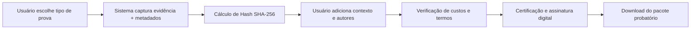

# A+ Fácil

**Auditoria Digital e Preservação Forense com Validade Jurídica**

---

## 🎯 Sobre o Produto

A+ Fácil é uma **plataforma de auditoria e preservação forense digital** que transforma capturas de tela, gravações e documentos em evidências digitais com validade jurídica. 

Diferente de screenshots ou vídeos comuns, nossa solução cria um **pacote probatório certificado** que inclui metadados técnicos imutáveis, trilhas de auditoria cronológicas e assinatura digital padrão ICP-Brasil.

### 💡 O Problema que Resolvemos

No ambiente digital atual, é cada vez mais comum a necessidade de preservar provas eletrônicas para:
- Processos judiciais e administrativos
- Compliance e auditorias corporativas
- Proteção contra fraudes e crimes digitais
- Registro de propriedade intelectual
- Documentação de incidentes e ocorrências

Porém, evidências digitais tradicionais são facilmente questionáveis: podem ser editadas, não possuem rastreabilidade e carecem de contexto técnico confiável.

### ✅ Nossa Solução

Transformamos qualquer captura digital em uma **prova forense certificada** através de:

1. **Captura Contextualizada**: Coleta automática de metadados técnicos (IP, geolocalização, dispositivo, timestamp)
2. **Integridade Garantida**: Hash SHA-256 e logs de auditoria imutáveis
3. **Certificação Legal**: Assinatura digital PAdES com certificado e-CNPJ (ICP-Brasil)
4. **Rastreabilidade Total**: Chain of Custody completa desde a captura até o certificado final

---

## 🎬 Modalidades de Evidência

### 📹 Gravação de Tela
Capture interações em tempo real na web com áudio do sistema.

**Casos de uso:**
- Conversas em redes sociais (WhatsApp Web, Messenger, Instagram)
- Emails e documentos online
- Sites fraudulentos ou phishing
- Sistemas internos e plataformas corporativas

### 🎥 Gravação de Câmera
Registre depoimentos, vistorias e evidências físicas.

**Casos de uso:**
- Vistorias de imóveis e veículos
- Declarações e depoimentos
- Unboxing de produtos
- Registro de danos materiais

### 📄 Upload de Arquivo
Certifique documentos e mídias pré-existentes.

**Casos de uso:**
- Contratos e documentos jurídicos
- Áudios de gravadores externos
- Fotos e vídeos anteriores
- Arquivos digitalizados

---

## 🔐 Garantias Técnicas

### Metadados Coletados
Cada evidência captura automaticamente:
- ✅ Endereço IP e Provedor de Internet (ISP)
- ✅ Navegador, Sistema Operacional e User Agent
- ✅ Tipo e modelo do dispositivo
- ✅ Geolocalização precisa (Lat/Long + Endereço)
- ✅ Timestamp com fuso horário
- ✅ Identificação do autor (CPF/RG/Email)

### Criptografia e Hashing
- **SHA-256**: Impressão digital única do arquivo
- **Logs Imutáveis**: Timeline cronológica de todas as ações
- **Assinatura Digital**: Certificado PAdES com e-CNPJ A1

### Validade Jurídica
Nossos certificados seguem os padrões:
- 📜 ICP-Brasil (Infraestrutura de Chaves Públicas Brasileira)
- 📜 ISO/IEC 27001 (Boas práticas de segurança da informação)
- 📜 LGPD (Lei Geral de Proteção de Dados)

---

## 🏗️ Arquitetura do Sistema

### Frontend (React + TypeScript)
Progressive Web App (PWA) com suporte offline e instalação nativa.

**Tecnologias:**
- React 18 + TypeScript (Strict)
- Vite (Build ultra-rápido)
- PWA (Service Worker + Cache Strategy)
- MediaRecorder API (Captura nativa do navegador)

### Backend (Node.js + MongoDB)
API RESTful de alta disponibilidade com processamento assíncrono.

**Tecnologias:**
- Node.js 18+ + Express + TypeScript
- MongoDB (Mongoose ODM)
- Firebase Storage / Google Cloud Storage
- EFI (Gateway de pagamento PIX)
- Node-Cron (Automação de tarefas)

### Segurança & Compliance
- **JWT** (Autenticação stateless)
- **Helmet** (Headers HTTP seguros)
- **Rate Limiting** (Proteção contra abuso)
- **Assinatura Digital PDF** (pdf-signer-brazil)
- **Bcrypt** (Hash de senhas)

---

## 📦 Repositórios

| Repositório | Descrição | Stack Principal |
|------------|-----------|----------------|
| **`amaisfacil-system`** | Frontend da plataforma | React, TypeScript, Vite, PWA |
| **`amaisfacil-api`** | Backend e API RESTful | Node.js, Express, MongoDB |

---

## 🚀 Como Funciona (Fluxo Simplificado)

1. **Captura**: Gravação ou upload com coleta automática de metadados
2. **Contextualização**: Descrição detalhada e identificação dos autores
3. **Validação**: Revisão de custos e aceite de termos legais
4. **Certificação**: Geração de certificado PDF assinado digitalmente
5. **Entrega**: Download seguro + QR Code para validação pública

---

## 📊 Aplicações Práticas

### Setor Jurídico
- Produção de provas digitais para processos
- Preservação de evidências em casos de difamação online
- Registro de propriedade intelectual (anterioridade autoral)

### Empresas e E-commerce
- Documentação de reclamações e atendimentos
- Vistorias de entrega e logística
- Compliance e auditorias internas

### Segurança e Investigação
- Registro de crimes digitais (fraudes, ameaças)
- Perícia forense digital
- Documentação de incidentes de segurança

### Uso Pessoal
- Proteção contra calúnia e difamação
- Registro de danos em imóveis ou veículos
- Documentação de incidentes diversos

---

## 👨‍💻 Desenvolvedor

**João Dutra** ([@odutradev](https://github.com/odutradev))

Desenvolvedor Full Stack especializado em soluções de alta disponibilidade e segurança digital.

---

## 📞 Contato

Para dúvidas, sugestões ou parcerias:

- 🌐 Website: [amaisfacil.com](https://amaisfacil.com)
- 📧 Email: contato@amaisfacil.com
- 💼 GitHub Org: [@AmaisFacil](https://github.com/AmaisFacil)

---

**Transformando capturas digitais em evidências jurídicas**

🛡️ Seguro • ⚖️ Legal • 🔒 Imutável

